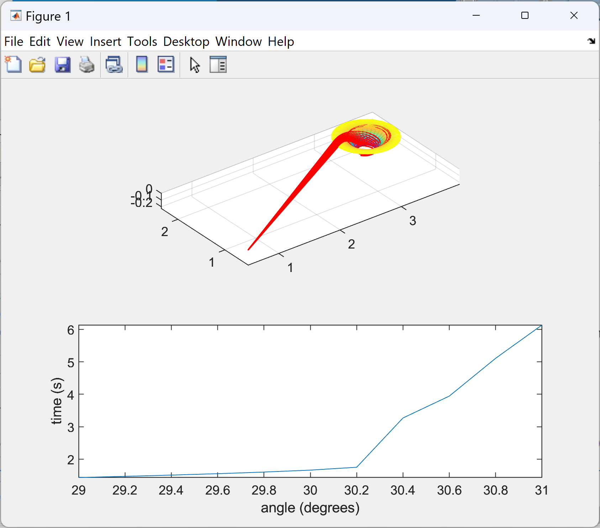
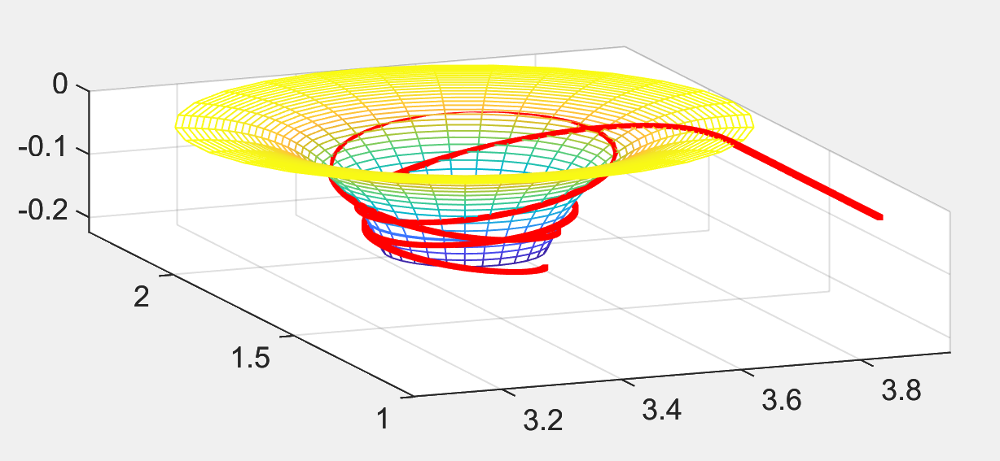
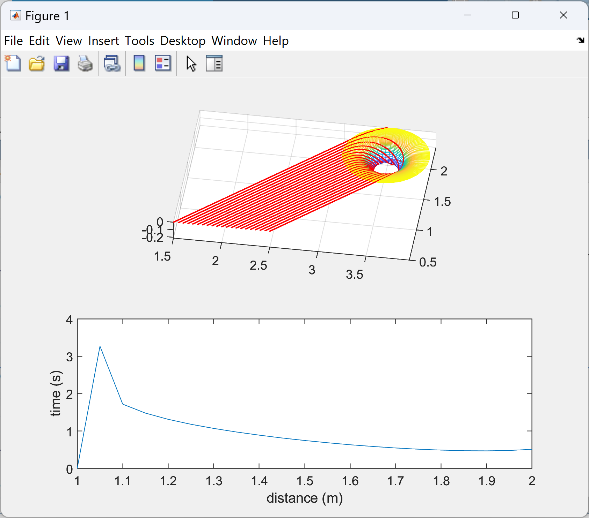

# Titan Endurance Simulation 
MATLAB script that simulates launch scenarios 

## Background 
The Titan spacecraft system is a two-body system consisting of a Launcher and an Orbiter capable of deploying various standard Landers to explore Titan in a simulated environment. The Launcher is responsible for launching the Orbiter [from Earth] so that it approaches Titan with accurate direction and speed. The Orbiter must then launch the Lander into Titan’s gravitational field such that it orbits as long as possible before landing. 

## Features
- Created a dynamic model for the lander during orbit  
- Extracted useful information from the data to optimize lander trajectories  

## Screenshots

## Contact
Created by [@EthanGray](https://github.com/Egray180) - feel free to contact me at egray180@student.ubc.ca
